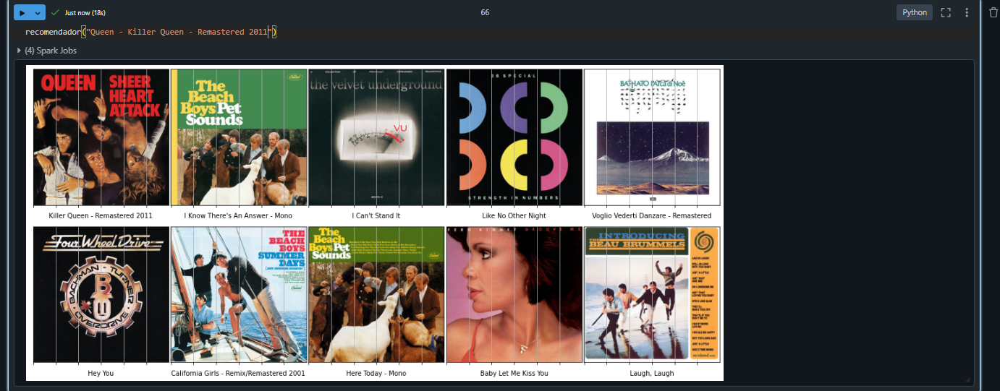

# Extração, Análise e Clusterização dos dados de música do Spotify para sistema de Recomendação 
### Dataset: https://www.kaggle.com/datasets/vatsalmavani/spotify-dataset
#### Tecnologias utilizadas: Databricks, Apache Spark, Spark MLib, Python (Pandas, Scipy, Spotipy, Plotly).

#### Exemplo de OutPut utilizando a música Queen - Killer Queen

